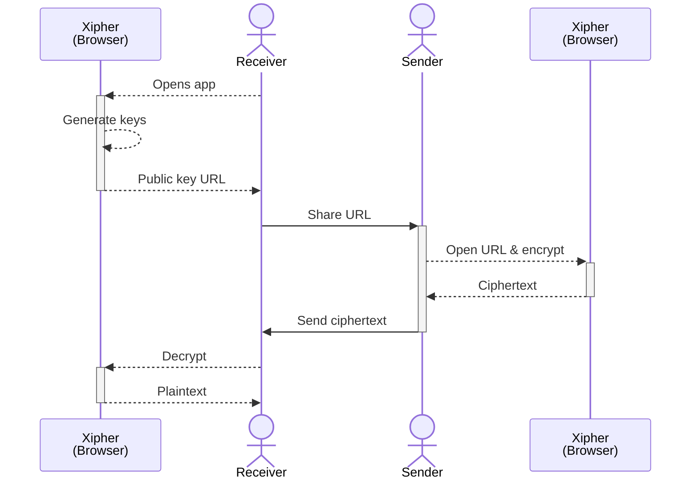

<div align="center">
	
	<h1>Xipher</h1>
	<p><strong>Secure asymmetric encryption with password-based keys</strong></p>
	
[](https://pkg.go.dev/xipher.org/xipher)
[](https://goreportcard.com/report/xipher.org/xipher)
[](https://github.com/shibme/xipher/actions/workflows/test.yaml)
[](https://github.com/shibme/xipher/actions/workflows/release.yaml)
[](https://github.com/shibme/xipher/blob/main/LICENSE)

</div>

## Overview

Xipher is a curated collection of cryptographic primitives designed for secure password-based asymmetric encryption. It enables secure data sharing between parties over insecure channels using password-derived public keys, combining modern cryptography with post-quantum security.

## Features

- **🔐 Asymmetric Encryption**: Encrypt data with public keys derived from passwords
- **📦 Stream Processing**: Built-in compression and streaming for memory efficiency  
- **🛡️ Post-Quantum Security**: Optional Kyber1024 algorithm support
- **🌐 Multi-Platform**: CLI, Go library, Web Assembly, and web interface
- **⚡ Performance**: Optimized for both small and large data encryption
- **🔧 Easy Integration**: Simple APIs for developers

## Quick Start

### Installation

#### CLI Tool

**Homebrew (macOS):**
```bash
brew install shibme/tap/xipher
```

**Install Script:**
```bash
# Latest version
curl -fsSL https://xipher.org/install/install.sh | sh

# Specific version  
curl -fsSL https://xipher.org/install/install.sh | sh -s v1.1.0
```

**Binary Download:**
Download from [releases page](https://github.com/shibme/xipher/releases/latest)

**Docker:**
```bash
docker run --rm -v $PWD:/data -it shibme/xipher help
```

#### Go Package
```bash
go get -u xipher.org/xipher
```

### Basic Usage

#### CLI Example


#### Go Package Example
```go
package main

import (
	"encoding/base32"
	"fmt"
	"xipher.org/xipher"
)

func main() {
	// Create secret key from password
	secretKey, err := xipher.NewSecretKeyForPassword([]byte("your-secure-password"))
	if err != nil {
		panic(err)
	}

	// Derive public key
	publicKey, err := secretKey.PublicKey(false)
	if err != nil {
		panic(err)
	}

	// Encrypt data
	plaintext := []byte("Hello, World!")
	ciphertext, err := publicKey.Encrypt(plaintext, true)
	if err != nil {
		panic(err)
	}

	// Decrypt data
	decrypted, err := secretKey.Decrypt(ciphertext)
	if err != nil {
		panic(err)
	}

	fmt.Printf("Original: %s\n", plaintext)
	fmt.Printf("Decrypted: %s\n", decrypted)
}
```

## Usage Scenarios

### Web Interface
Experience Xipher directly in your browser at [xipher.org](https://xipher.org)

**Workflow:**
1. **Receiver** opens Xipher web app → generates key pair (stored in browser)
2. **Receiver** shares the public key URL with sender
3. **Sender** opens encryption URL → inputs data → gets encrypted result
4. **Sender** shares ciphertext with receiver
5. **Receiver** decrypts using stored private key



### GitHub Actions Integration
```yaml
steps:
- name: Setup Xipher
  uses: shibme/xipher@v1
  with:
    version: 1.17.0  # optional
```

### Host Your Own Web Interface
```yaml
name: Publish Xipher Web
on:
  workflow_dispatch:
jobs:
  pages:
    uses: shibme/xipher/.github/workflows/pages.yaml@main
```

### Web Assembly
```html
<html>
<head>
	<meta charset="utf-8"/>
	<script src="https://xipher.org/wasm/wasm_exec.js"></script>
	<script>
		const go = new Go();
		WebAssembly.instantiateStreaming(
			fetch("https://xipher.org/wasm/xipher.wasm"), 
			go.importObject
		).then((result) => {
			go.run(result.instance);
		});
	</script>
</head>
<body>
	<!-- Call methods starting with 'xipher', e.g., xipherNewSecretKey() -->
</body>
</html>
```

## Technical Details

### Cryptographic Algorithms
- **Key Derivation**: [Argon2id](https://en.wikipedia.org/wiki/Argon2) for secure password hashing
- **Elliptic Curve**: [Curve25519](https://en.wikipedia.org/wiki/Curve25519) for key exchange
- **Post-Quantum**: [CRYSTALS-Kyber](https://pq-crystals.org/kyber/) via [CIRCL](https://github.com/cloudflare/circl)
- **Symmetric Encryption**: [XChaCha20-Poly1305](https://en.wikipedia.org/wiki/ChaCha20-Poly1305)
- **Compression**: [Zlib](https://en.wikipedia.org/wiki/Zlib) for data compression

## Documentation

- **API Reference**: [pkg.go.dev/xipher.org/xipher](https://pkg.go.dev/xipher.org/xipher)
- **Web Interface**: [xipher.org](https://xipher.org)
- **Examples**: See [usage examples](#basic-usage) above

## Contributing

We welcome contributions! Please:

1. Fork the repository
2. Create a feature branch
3. Make your changes
4. Add tests if applicable
5. Submit a pull request

For bugs and feature requests, please [open an issue](https://github.com/shibme/xipher/issues).

## Security

This project is experimental and should be used with caution in production environments. If you discover security vulnerabilities, please [report them responsibly](https://github.com/shibme/xipher/security/advisories).

### Security Considerations
- Password strength directly affects security
- Post-quantum algorithms are still evolving
- Regular updates recommended for latest security patches

## License

This project is licensed under the terms specified in the [LICENSE](LICENSE) file.

## Acknowledgments

Special thanks to the projects and people that made Xipher possible:

- **[Retriever](https://retriever.corgea.io/)** - Inspiration for web-based encryption concepts
- **[CIRCL](https://github.com/cloudflare/circl)** by Cloudflare - Post-quantum cryptography support
- **[StreamSaver.js](https://github.com/jimmywarting/StreamSaver.js)** - Browser file saving capabilities
- **[age](https://github.com/FiloSottile/age)** - Inspiration for Curve25519 and XChaCha20-Poly1305 usage

---

<div align="center">
	<p>Made with ❤️ for secure communication</p>
</div>