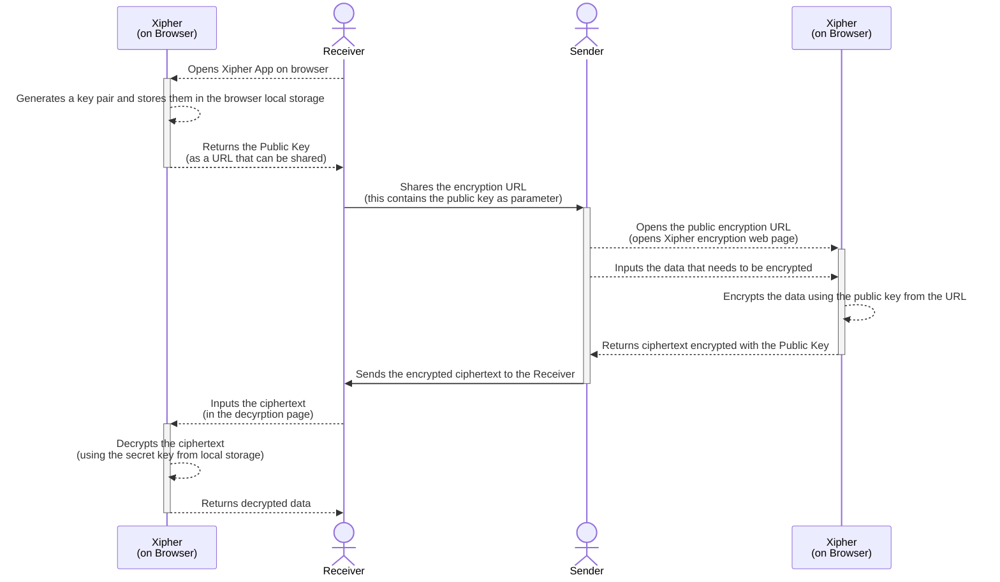
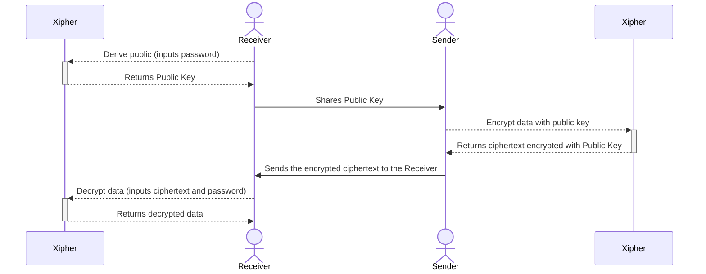

# Xipher
[](https://pkg.go.dev/dev.shib.me/xipher)
[](https://goreportcard.com/report/dev.shib.me/xipher)
[](https://github.com/shibme/xipher/actions/workflows/test.yaml)
[](https://github.com/shibme/xipher/actions/workflows/release.yaml)
[](https://github.com/shibme/xipher/blob/main/LICENSE)

Xipher is a curated collection of cryptographic primitives put together to perform key/password based asymmetric encryption.

## What does it do?
- Allows sharing of data securely between two parties over an insecure channel using asymmetric encryption.
- The sender encrypts the data using a public key (of the receiver - usually derived from a password) and shares the encrypted data with the receiver.
- The receiver decrypts the data using the secret key (or password).

## Key Aspects
- Encrypts data with the public key generated based on a password.
- Supports stream cipher along with stream compression, resulting in lower memory footprint and smaller ciphertext.
- Supports post-quantum cryptography using the Kyber1024 algorithm.

## CLI
Download the latest binary from the [releases](https://github.com/shibme/xipher/releases/latest) page and add it to your path.

### Demo


### Homebrew
Xipher can be installed with brew using the following command on macOS
```zsh
brew install shibme/tap/xipher
```

### Install Script

#### Install Latest Version
**With Shell (MacOs/Linux):**
```sh
curl -fsSL https://dev.shib.me/xipher/install/install.sh | sh
```
**With PowerShell (Windows):**
```powershell
irm https://dev.shib.me/xipher/install/install.ps1 | iex
```

#### Install Specific Version
**With Shell (MacOs/Linux):**
```sh
curl -fsSL https://dev.shib.me/xipher/install/install.sh | sh -s v1.1.0
```
**With PowerShell (Windows):**
```powershell
$v="1.1.0"; irm https://dev.shib.me/xipher/install/install.ps1 | iex
```

### Docker
You can also run Xipher without installing using Docker:
```zsh
docker run --rm -v $PWD:/data -it shibme/xipher help
```

## Web Interface
A web interface interoperable with the CLI, implemented using [web assembly](#web-assembly) is available [here](https://dev.shib.me/xipher).

### How does Xipher Web App work?
- Receiver opens the Xipher web app on a browser.
- Xipher generates a key pair and stores them in the browser local storage.
- The Xiher web app returns the public key as a URL that can be shared.
- Receiver shares the encryption URL (this contains the public key as a parameter) with the sender.
- Sender opens the public encryption URL (opens Xipher encryption web page).
- Sender inputs the data that needs to be encrypted.
- Xipher encrypts the data using the public key from the URL.
- Xipher returns ciphertext encrypted with the public key.
- Sender sends the encrypted ciphertext to the receiver.
- Receiver inputs the ciphertext in the decryption page.
- Xipher decrypts the ciphertext using the secret key from local storage.
- Xipher returns decrypted data.

The following sequence diagram illustrates the workflow of the web app.


## Using as a Go package
Install the package
```sh
go get -u dev.shib.me/xipher
```
Use it in your code
```go
package main

import (
	"encoding/base32"
	"fmt"

	"dev.shib.me/xipher"
)

func main() {
	// Creating a new secret key for password
	scrtKey, err := xipher.NewSecretKeyForPassword([]byte("Paws0meKittyKuwan!"))
	if err != nil {
		panic(err)
	}

	// Deriving  public key from secret key
	pubKey, err := scrtKey.PublicKey(false)
	if err != nil {
		panic(err)
	}
	publicKeyBytes, err := pubKey.Bytes()
	if err != nil {
		panic(err)
	}
	fmt.Println("PublicKey:", base32.StdEncoding.WithPadding(base32.NoPadding).EncodeToString(publicKeyBytes))

	platinText := []byte("Hello World!")

	// Encrypting plain text with public key
	cipherText, err := pubKey.Encrypt(platinText, true)
	if err != nil {
		panic(err)
	}
	fmt.Println("Encrypted:", base32.StdEncoding.WithPadding(base32.NoPadding).EncodeToString(cipherText))

	// Decrypting cipher text with secret key
	plainText, err := scrtKey.Decrypt(cipherText)
	if err != nil {
		panic(err)
	}
	fmt.Println("Decrypted:", string(plainText))
}
```

## Web Assembly
To use xipher as a web assembly (wasm) module in a browser app, follow the example below.
```html
<html>
	<head>
		<meta charset="utf-8"/>
		<script src="https://dev.shib.me/xipher/wasm/wasm_exec.js"></script>
		<script>
			const go = new Go();
			WebAssembly.instantiateStreaming(fetch("https://dev.shib.me/xipher/wasm/xipher.wasm"), go.importObject).then((result) => {
				go.run(result.instance);
			});
		</script>
	</head>
<body>
	Call wasm methods that begin with xipher. For example: xipherNewSecretKey()
</body>
</html>
```

## Under the hood
Xipher uses the following algorithms and libraries to achieve its functionality:
- [Argon2id](https://en.wikipedia.org/wiki/Argon2) for password hashing.
- [Curve25519](https://en.wikipedia.org/wiki/Curve25519) for elliptic curve cryptography.
- [CRYSTALS-Kyber](https://pq-crystals.org/kyber/) using [CIRCL](https://github.com/cloudflare/circl) library for post-quantum cryptography.
- [XChaCha20-Poly1305](https://en.wikipedia.org/wiki/ChaCha20-Poly1305) for symmetric encryption.
- [Zlib](https://en.wikipedia.org/wiki/Zlib) for compression.

## Workflow
The following sequence diagram illustrates the workflow of Xipher in encrypting data using a password based public key.


## Disclaimer
This tool/library is provided without any warranties, and there is no guarantee of its stability. Due to the experimental nature of some of its components, it is anticipated that modifications to the code, repository, and API will be made in the future. Caution is advised before incorporating this into a production application. Please [report](https://github.com/shibme/xipher/security/advisories) any identified security issues promptly. Your cooperation in notifying us of such concerns is highly appreciated.
