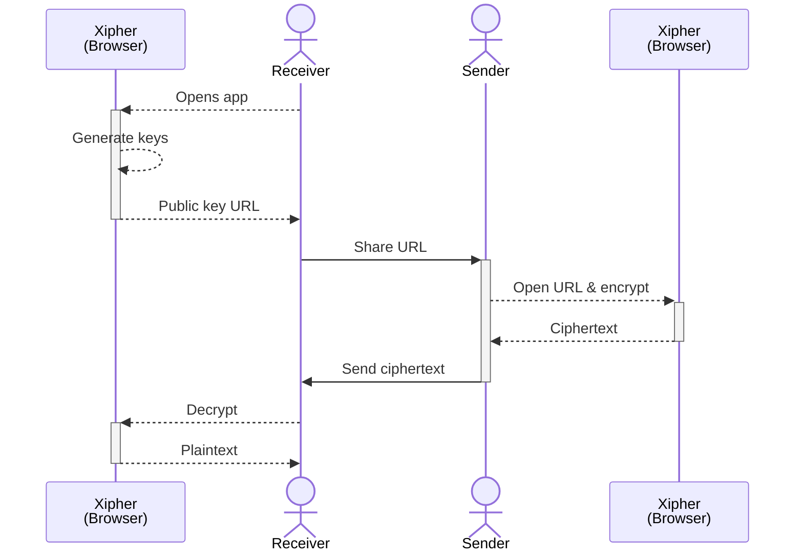

<div align="center">
	
	<h1>Xipher</h1>
	<p><strong>Secure asymmetric encryption with password-based keys</strong></p>
	
[](https://pkg.go.dev/xipher.org/xipher)
[](https://goreportcard.com/report/xipher.org/xipher)
[](https://github.com/shibme/xipher/actions/workflows/test.yaml)
[](https://github.com/shibme/xipher/actions/workflows/release.yaml)
[](https://github.com/shibme/xipher/blob/main/LICENSE)

</div>

## Overview

Xipher is a collection of cryptographic primitives for password-based asymmetric encryption. It lets you share encrypted data between parties over insecure channels using public keys derived from passwords. Includes support for post-quantum algorithms.

## Features

- Asymmetric encryption using password-derived public keys
- Stream processing with built-in compression
- Post-quantum security (optional Kyber1024 support)
- Available as CLI tool, Go library, WebAssembly module, and web interface
- Optimized for both small and large data

## Quick Start

### Installation

#### CLI Tool

**Homebrew (macOS):**
```bash
brew install shibme/tap/xipher
```

**Install Script (Linux/macOS):**
```bash
# Latest version
curl -fsSL https://xipher.org/install/install.sh | sh

# Specific version  
curl -fsSL https://xipher.org/install/install.sh | sh -s v1.17.0
```

**Install Script (Windows):**
```powershell
# PowerShell (latest version)
irm https://xipher.org/install/install.ps1 | iex

# PowerShell with specific version
$v="1.17.0"; irm https://xipher.org/install/install.ps1 | iex
```

**Binary Download:**
Download from [releases page](https://github.com/shibme/xipher/releases/latest)

**Docker:**
```bash
docker run --rm -v $PWD:/data -it shibme/xipher help
```

#### Go Package
```bash
go get -u xipher.org/xipher
```

### Basic Usage

#### CLI Example


#### Go Package Example
```go
package main

import (
	"encoding/base32"
	"fmt"
	"xipher.org/xipher"
)

func main() {
	// Create secret key from password
	secretKey, err := xipher.NewSecretKeyForPassword([]byte("your-secure-password"))
	if err != nil {
		panic(err)
	}

	// Derive public key
	publicKey, err := secretKey.PublicKey(false)
	if err != nil {
		panic(err)
	}

	// Encrypt data
	plaintext := []byte("Hello, World!")
	ciphertext, err := publicKey.Encrypt(plaintext, true)
	if err != nil {
		panic(err)
	}

	// Decrypt data
	decrypted, err := secretKey.Decrypt(ciphertext)
	if err != nil {
		panic(err)
	}

	fmt.Printf("Original: %s\n", plaintext)
	fmt.Printf("Decrypted: %s\n", decrypted)
}
```

## Usage

### Web Interface
Try it out at [xipher.org](https://xipher.org)

How it works:

1. The receiver opens the web app and generates a key pair (keys are saved in the browser).
2. The receiver shares their public key URL with the sender.
3. The sender opens this URL, encrypts their data using the receiver's encryption URL, and then sends the resulting ciphertext (or encrypted link) back to the receiver.
4. The receiver decrypts the ciphertext in the same browser where the key pair was originally generated.



### GitHub Actions Integration
```yaml
steps:
- name: Setup Xipher
  uses: shibme/xipher@v1
  with:
    version: 1.17.0  # optional
```

### Host Your Own Web Interface
```yaml
name: Publish Xipher Web
on:
  workflow_dispatch:
jobs:
  pages:
    uses: shibme/xipher/.github/workflows/pages.yaml@main
```

### Web Assembly
```html
<html>
<head>
	<meta charset="utf-8"/>
	<script src="https://xipher.org/wasm/wasm_exec.js"></script>
	<script>
		const go = new Go();
		WebAssembly.instantiateStreaming(
			fetch("https://xipher.org/wasm/xipher.wasm"), 
			go.importObject
		).then((result) => {
			go.run(result.instance);
		});
	</script>
</head>
<body>
	<!-- Call methods starting with 'xipher', e.g., xipherNewSecretKey() -->
</body>
</html>
```

## Technical Details

### Algorithms

- Key derivation: [Argon2id](https://en.wikipedia.org/wiki/Argon2)
- Elliptic curve: [Curve25519](https://en.wikipedia.org/wiki/Curve25519) with ephemeral key exchange
- Post-quantum: [Kyber 1024](https://pq-crystals.org/kyber/) (ML-KEM)
- Symmetric encryption: [XChaCha20-Poly1305](https://en.wikipedia.org/wiki/ChaCha20-Poly1305)
- Compression: [Zlib](https://en.wikipedia.org/wiki/Zlib)

> **Note**: v1.19+ uses Go's native ML-KEM package for post-quantum crypto ([FIPS 203](https://csrc.nist.gov/pubs/fips/203/final) compliant). This breaks compatibility with previous Kyber implementations. Standard ECC encryption is unaffected.

## Documentation

- API docs: [pkg.go.dev/xipher.org/xipher](https://pkg.go.dev/xipher.org/xipher)
- Web interface: [xipher.org](https://xipher.org)

## Contributing

Contributions are welcome. Fork the repo, make your changes, and submit a pull request. For bugs or feature requests, [open an issue](https://github.com/shibme/xipher/issues).

## Security

This project is experimental - use with caution in production. If you find security issues, please [report them](https://github.com/shibme/xipher/security/advisories).

A few things to keep in mind:
- Password strength matters
- Post-quantum algorithms are still evolving
- Keep your dependencies updated

## License

This project is licensed under the terms specified in the [LICENSE](LICENSE) file.

## Acknowledgments

Thanks to these projects:

- [Retriever](https://retriever.corgea.io/) - Inspiration for web-based encryption concepts
- [StreamSaver.js](https://github.com/jimmywarting/StreamSaver.js) - Browser file saving capabilities
- [age](https://github.com/FiloSottile/age) - Inspiration for Curve25519 and XChaCha20-Poly1305 usage